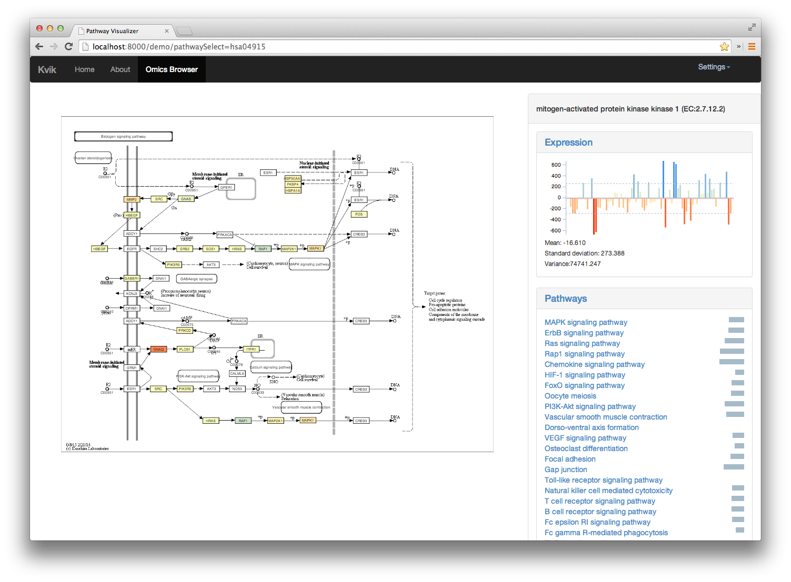

# Kvik
An interactive system for exploring the dynamics of carcinogenesis through integrated studies of biological pathways and genomic data. It provides researchers with a lightweight web application for navigating through biological pathways from the [KEGG](http://kegg.jp) database integrated with genomic data from the [NOWAC](http://site.uit.no/nowac) postgenome biobank.

## About
My master's thesis project at the [BDPS](http://bdps.cs.uit.no) group at [UiT](http://uit.no). You can find the thesis [here](doc/thesis.pdf) and presentation of the thesis [here](doc/presentation.pdf).

## Source Code
The source code is found in the [src](src/src/github.com/fjukstad) directory. It consists of four individual components all written in Go. The Data Engine expects data from the NOWAC biobank and will not run without it. Note that both the Frontend and the Data Engine depends on [gorest](code.google.com/p/gorest). 

## Contact
Feel free to contact me at bjorn.fjukstad@uit.no! 
